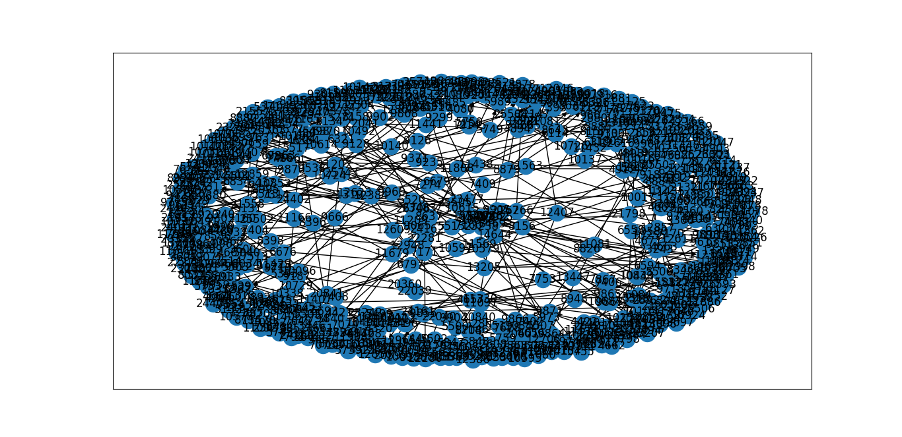
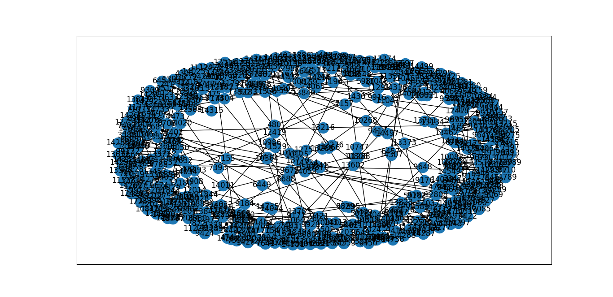
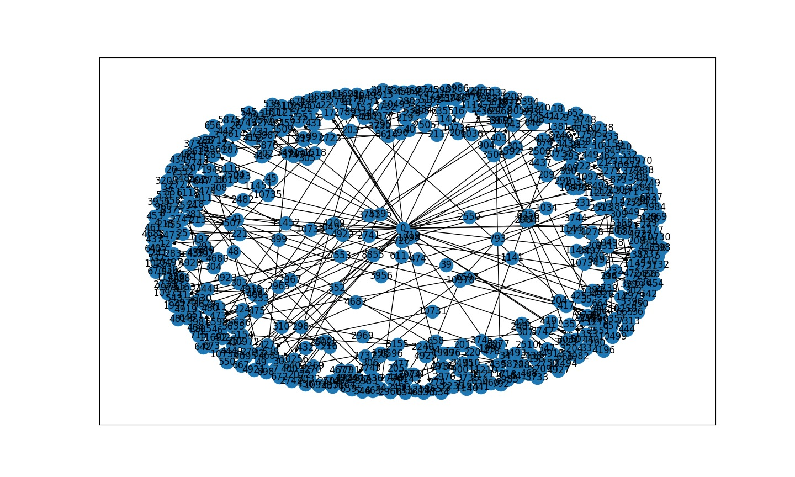
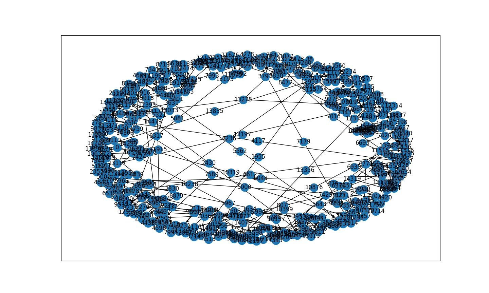
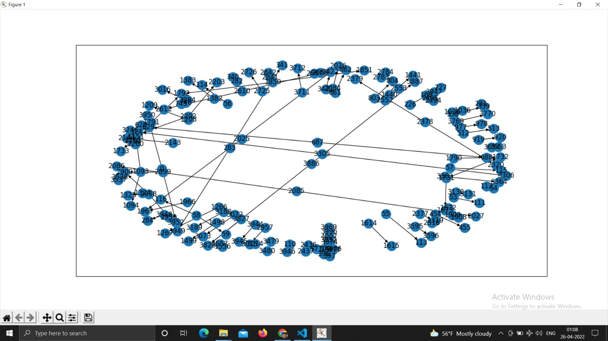
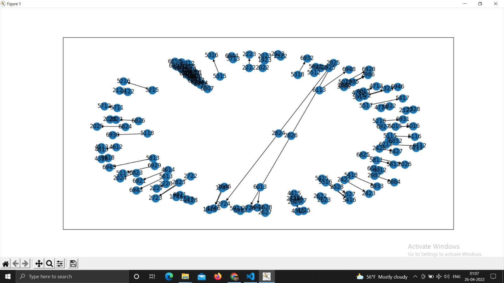
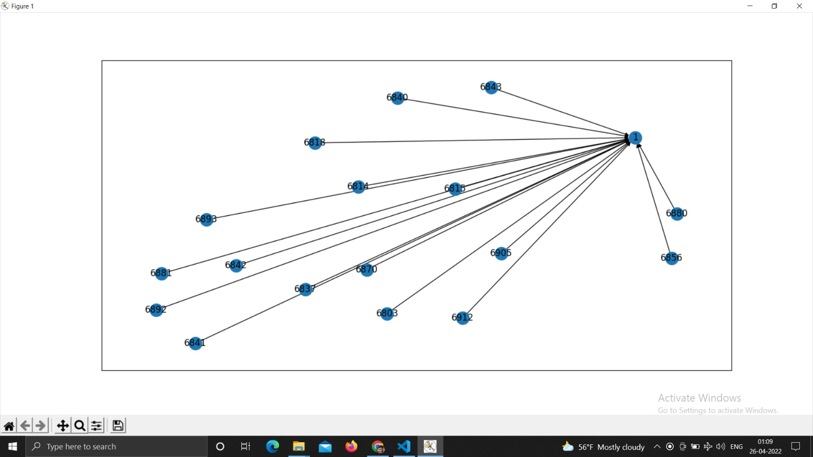

# Graphcut_Algorithm

## Description
I have used the algorithm discussed in paper "Graphcut Textures: Image and Video Synthesis Using Graph Cuts" to synthesize an image with significantly larger dimensions from a sample image.

## Step By Step Process
The overall flow of the process goes as follows:
* First select the sample patch image that will be  randomly positioned in final large dimension image. 
* For overlapped images we need to implement the graphcut algorithm on the overlapped pixels for smoothening the edges of the patch.
* We represent this overlapped region in the form of graph and run edmonds karp minimum cut algorithm over it to ensure these smooth edges and this minimum cut is treated as the boundary for the inclusion of pixels from the overlapped images.
* This process is repeated until we reach the maximum dimensions of the output image.
* The boundary for the inclusion of pixels from the overlapped images is set by this minimum cut.
* We repeat this process until the final image's dimensions are maxed out.

## Project Implementation
### Ford-Fulkerson Algorithm
The basic working of the Ford-Fulkerson algorithm goes as follows:
1. Construct the residual graph for given graph.
2. Attempt to find a path from source to sink in the residual graph.
3. If a path exists, it gives us an augmenting path, which we use to improve given graph and go back to step 1.
4. If no path exists, we obtain minimum cut whose capacity is equal to the value of given graph. We know given graph is optimal, and the cut gives us a certificate of optimality.

The running time of the Ford-Fulkerson Algorithm is O(∣E∣⋅f)
where |E| is the number of edges and f is the maximum flow.

### Edmonds-Karp Algorithm
The Edmonds-Karp Algorithm is a specific implementation of the Ford-Fulkerson method.
1. In particular, Edmonds-Karp algorithm implements the searching for an augmenting path using the Breadth First Search (BFS) algorithm to find the shortest path from source to sink and the minimum residual capacity along that path, min. 
2. We then walk the augmenting path from target to source. 
3. Using the minium residual capacity, we reduce all residual capacities on the augmenting path by min and increase the residual capacities on the reverse edges (representing the flow).

The Edmonds-Karp algorithm runs in O(VE2)

## Statement of Help
How to install dependencies : `pip install -r requirements.txt`

How to run the code : `python3 .\code\graphcut.py $sample_img_name_path$ $output_img_name_path$ $output_height$ $output_width$`
eg. `python3 .\code\graphcut.py .\images\input\green.gif .\images\output\result.jpeg 512 512`

How to interpret the output : The resulting image will be generated in result.jpeg after code execution. This resulting output is a synthesized image from the sample image. The dimensions of this image will be equal to the dimensions specified above (512 * 512).

## Implementation 
### Libraries Used
* cv2 -> To perform read and write operations using images.
* numpy -> To effectively deal with 2d and 3d matrices.
* matplotlib -> To plot graphs.
* networkx -> To create graphs from the overlapped pixels.

## Input / Output
<pre>       ---------------------------------->    </pre>
<pre>       ---------------------------------->    </pre>

## Converting problem/solution
As the algorithm indicates, a graph of the overlapped region between the patches is created using networkx. One such generated graph is displayed below :

### Graph Generation
<pre>            </pre>

### Intermediate Steps
The graphs below depict the edges that contribute to the cost of the intermediate phases' minimum cut. Two sets of nodes are returned after performing the Edmonds Karp algorithm. The left image nodes are represented by one, while the right image nodes are represented by the other. These graphs simply show the nodes and their accompanying edges, which are clipped once the method is applied.

Several intermediate graphs were created during the procedure, but the six graphs below adequately depict the graph's trajectory. The initial graphs have a high density since both sections contribute to the minimal cut. However, as we progress, the new image (right) adds more to the seam than the previous one (left).
<pre>         </pre>
<pre>         </pre>
<pre>         </pre>
<pre>         </pre>
<pre>                 </pre>
<pre>                 </pre>

## References

https://networkx.org/documentation/stable/reference/index.html

https://www.csee.umbc.edu/~adamb/641/resources/GraphcutTextures.pdf

https://www.cc.gatech.edu/cpl/projects/graphcuttextures/

https://jamieheller.github.io/theory.html#edmondskarp

https://faculty.math.illinois.edu/~mlavrov/docs/482-fall-2019/lecture26.pdf

https://github.com/ErictheSam/Graphcut

